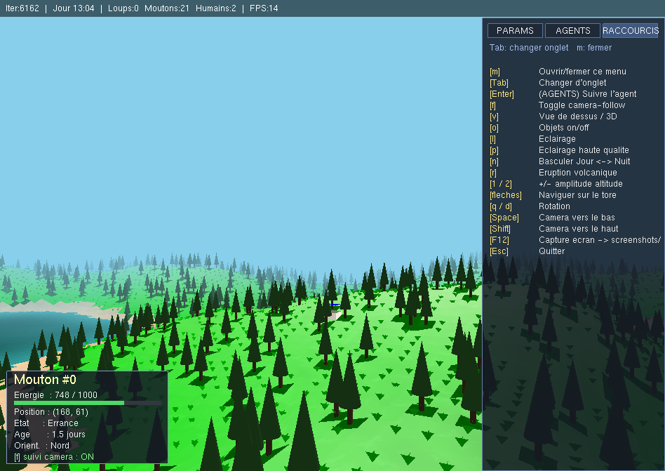

# Projet Environnement 3D

Création et modélisation d'un écosystème dynamique 3D simplifié, implémentant
plusieurs mécanismes : automates cellulaires, système de décision des agents,
générateur d'altitude, modèle proie-prédateur, bruit de Perlin, système de
Lindenmayer (L-système) et monde torique.



Voir [docs/presentation-projet.pdf](docs/presentation-projet.pdf) pour la présentation académique du projet.

## Caractéristiques

- **Monde torique** 200×200 cellules — les bords se rejoignent, la distance se calcule modulo
- **Génération de terrain** par bruit de Perlin (`PerlinNoiseLandscapeGenerator`) ou chargement d'images PNG (`landscapes/`)
- **Trois automates cellulaires** : forêt, herbe et lave — chacun avec ses propres règles ; la pierre est gérée par le système Layer (couches empilées par cellule)
- **Système multi-agents** : prédateurs (loups), proies (moutons), humains, organisés en machine à états en couches (Perception / Décision / Locomotion)
- **Cycle jour / nuit** : cycle 24 h de jeu configurable, avec asymétrie jour/nuit et transitions douces
- **Arbre fractal** généré par L-système
- **Éruption volcanique** déclenchable au clavier, avec modèle physique de coulée et solidification
- **Modèles 3D GLB** (glTF binaire) chargés depuis `models/` par un loader maison

## Prérequis

| | Version recommandée | Comment l'obtenir |
|---|---|---|
| **JDK** | OpenJDK 17 (11+ accepté) | `sudo apt install openjdk-17-jdk` |
| **Affichage OpenGL** | n'importe quel X11/Wayland | natif sur Linux ; WSLg sur Windows 11 ; XQuartz sur macOS |
| **JOGL 2.0-b66** | versionné dans le dépôt | déjà présent dans `JOGL/` |

JOGL est embarqué dans le dépôt (~50 Mo) car les versions modernes (2.3.2+) ont retiré le namespace `javax.media.opengl` utilisé par ce code. Voir `setup.sh` pour les détails.

## Installation et lancement

Trois manières d'utiliser ce projet, au choix : ligne de commande (la plus simple, la plus portable), Eclipse, ou VS Code. Les trois fonctionnent sur Linux, macOS et Windows — les particularités par plateforme (affichage OpenGL, shell, séparateur de classpath) sont décrites plus bas, voir [Notes par plateforme](#notes-pour-linux-et-macos).

### Option 1 — Ligne de commande (recommandé)

```bash
git clone https://github.com/KasselFelix/ProjectEnvironnement-3D.git
cd ProjectEnvironnement-3D
./setup.sh    # vérifie que JOGL et le JDK sont prêts
./run.sh      # compile (au besoin) puis lance la simulation
```

Une fenêtre OpenGL s'ouvre avec le paysage 3D. Pour lancer les tests JUnit :

```bash
./test-setup.sh   # une seule fois — télécharge le jar JUnit dans test/lib/
./test.sh         # compile + exécute tous les tests
```

### Option 2 — Eclipse

Le projet contient `.classpath` et `.project` versionnés dans le dépôt, donc l'import est immédiat.

1. **Prérequis** : disposer d'un **JDK 17** dans Eclipse (`Window → Preferences → Java → Installed JREs` → Add → pointer sur un JDK 17 si nécessaire).
2. **Import** : `File → Open Projects from File System…` → choisir le dossier `ProjectEnvironnement-3D/` → Finish. Le projet apparaît dans le Package Explorer sous le nom `GameOfLife`.
3. **Lancer la simulation** : clic droit sur `src/app/MyEcosystem.java` → **Run As → Java Application**. Eclipse crée automatiquement une Run Configuration ; les natives JOGL (Linux/Mac/Windows) sont chargées par GlueGen selon le système d'exploitation.
4. **Lancer les tests** : lancer d'abord `./test-setup.sh` une fois dans un terminal pour télécharger le jar JUnit, puis clic droit sur `test/src/cellularautomata/ecosystem/LavaCATest.java` → **Run As → JUnit Test**.

Si « Unbound classpath container » s'affiche → le JDK 17 n'est pas configuré dans Eclipse (étape 1). Si des accents apparaissent cassés (`?` à la place de `é`, `à`…) → `Window → Preferences → General → Workspace → Text file encoding: UTF-8`.

### Option 3 — VS Code

Le projet contient `.vscode/settings.json`, `.vscode/tasks.json`, `.vscode/extensions.json` versionnés.

1. **Ouvrir le dossier** `ProjectEnvironnement-3D/` directement (pas son parent) — les paramètres sont relatifs à ce dossier.
2. **Installer les extensions recommandées** : VS Code propose une fenêtre à la première ouverture. Sinon : icône Extensions → onglet « Recommended » → tout installer. Les indispensables sont **Extension Pack for Java** (Microsoft), **Test Runner for Java**, et **WSL** sous Windows.
3. **Lancer la simulation** par les tâches pré-configurées :
   - **Build** : `Ctrl+Shift+B` (tâche de compilation par défaut)
   - **Run** : `Ctrl+Shift+P` → `Tasks: Run Task` → `Run`
   - Pour lier **Run** à `F5`, ajouter ce raccourci (`Ctrl+Shift+P` → `Preferences: Open Keyboard Shortcuts (JSON)`) :
     ```json
     {
       "key": "f5",
       "command": "workbench.action.tasks.runTask",
       "args": "Run",
       "when": "resourceExtname == '.java'"
     }
     ```
4. **Lancer les tests** : lancer `./test-setup.sh` une fois dans un terminal intégré pour récupérer le jar JUnit, puis :
   - Cliquer sur l'onglet **Testing** (icône bécher dans la barre latérale) → arbre des tests (`LavaCATest`, `LoupTest`, `AgentBehaviorTest`…) → exécuter ou déboguer.
   - Ou clic droit sur une méthode `@Test` dans un fichier de test → `Run Test`.

Si l'arbre des tests reste vide après ouverture : `Ctrl+Shift+P` → **`Java: Clean Java Language Server Workspace`** → « Restart and delete ». L'extension réindexe le projet (~30 s) et reconnaît les tests.

### Notes pour Linux et macOS

Aucune configuration spécifique nécessaire. Les scripts `.sh`, le classpath séparé par `:`, et OpenGL sur le serveur X / Wayland (Linux) ou Quartz (macOS) fonctionnent sans réglage supplémentaire.

### Notes pour WSL (sous-système Linux de Windows)

Ce projet a été développé et testé sous **WSL2 + WSLg** (Windows 11). Le shell est `bash` ou `zsh`, les scripts `.sh` fonctionnent comme sur Linux natif. Une seule vérification est nécessaire — que WSLg est bien actif :

```bash
echo $WAYLAND_DISPLAY    # doit afficher "wayland-0"
```

Sous Windows 10 (sans WSLg), un serveur X côté Windows (VcXsrv, X410, XLaunch) est requis, avec `DISPLAY=:0` exporté avant `./run.sh`.

**En résumé, pour l'affichage des fenêtres :**
- **Windows 11 + WSL2** : aucun prérequis.
- **Windows 10 + WSL** : installer VcXsrv (~15 min), exporter `DISPLAY`.

**Côté IDE** : utiliser l'extension **WSL** de VS Code (déjà recommandée par le projet) pour ouvrir le dossier *depuis WSL* — VS Code se reconnecte au système de fichiers Linux et tout reste cohérent. Pour Eclipse : installer la version Linux d'Eclipse **dans** WSL (`sudo apt install eclipse`), plutôt qu'Eclipse Windows pointant sur `\\wsl$\Ubuntu\…` (chemins fragiles, performance médiocre).

### Notes pour Windows natif (PowerShell / cmd)

Les scripts `.sh` ne s'exécutent pas dans PowerShell ou cmd. Deux options.

**Option recommandée — Git Bash.** L'installation de [Git for Windows](https://git-scm.com/download/win) (gratuit, ~50 Mo) fournit `bash.exe` et un environnement Unix minimal. Ouvrir Git Bash dans le dossier `ProjectEnvironnement-3D/` ; `./setup.sh`, `./build.sh` et `./run.sh` fonctionnent alors exactement comme sous Linux. C'est la voie la plus simple.

**Option alternative — commandes manuelles en PowerShell.** En l'absence de Git Bash, voici les équivalents PowerShell des trois scripts principaux. Attention : sous Windows, le **séparateur de classpath est `;`** (et non `:` comme sous Linux/macOS).

```powershell
# Équivalent ./build.sh
Remove-Item -Recurse -Force bin -ErrorAction SilentlyContinue
New-Item -ItemType Directory bin | Out-Null
$src = Get-ChildItem -Path src -Recurse -Filter *.java
javac -d bin -cp "JOGL\jar\*" $src.FullName

# Équivalent ./run.sh (build déjà fait)
java -cp "bin;JOGL\jar\*" app.MyEcosystem
```

Pour cmd la syntaxe diffère encore ; préférer PowerShell ou Git Bash.

**Affichage** : aucune configuration nécessaire, OpenGL passe par le pilote GPU natif Windows. JOGL charge automatiquement `gluegen-rt-natives-windows-amd64.jar` et `jogl-all-natives-windows-amd64.jar`.

**IDE** : Eclipse Windows et VS Code Windows fonctionnent normalement — ils utilisent leur propre chaîne d'outils Java sans dépendre des scripts `.sh` ; Git Bash n'est pas nécessaire si le lancement est fait via l'IDE.

## Commandes disponibles

| Script | Action |
|---|---|
| `./setup.sh` | Vérifie que les dépendances sont prêtes (à lancer après un `git clone`) |
| `./build.sh` | Compile tout le code de `src/` vers `bin/` |
| `./run.sh` | Compile puis lance `app.MyEcosystem` |
| `./test-setup.sh` | Télécharge le jar JUnit dans `test/lib/` (idempotent, une seule fois) |
| `./test.sh` | Compile et exécute tous les tests JUnit 5 |

## Contrôles en jeu

| Touche / action | Effet |
|---|---|
| `m` | Ouvre / ferme le menu in-game (onglets AGENTS, RACCOURCIS, PARAMS) |
| `v` | Bascule vue de dessus ↔ vue 3D |
| Clic gauche (court) | Sélectionne un agent (picking) |
| Clic gauche maintenu | Déplace la carte, tourne la caméra ou orbite, selon la vue |
| Clic droit maintenu | Déplace la carte (pan « agrippe le sol ») |
| Molette | Zoom (échelle adaptée à la vue) |
| `f` | Active / désactive le suivi caméra de l'agent sélectionné |
| `c` | Pilotage manuel de l'agent sélectionné |
| `g` | Affiche / masque le graphe des populations |
| `n` | Bascule jour ↔ nuit |
| `↑ ↓ → ←` ou `Z Q S D` | Navigation sur la carte |
| `space` / `shift` | Abaisse / élève la caméra (appui long) |
| `o` | Affichage des objets |
| `l` / `p` | Éclairage |
| `1` / `2` | Amplitude des altitudes |
| `r` | Éruption volcanique |
| `F12` | Enregistre une capture PNG dans `screenshots/` |
| `h` | Affiche l'aide dans le terminal |
| `esc` | Bascule plein écran ↔ fenêtré (pour quitter : croix de la fenêtre) |

## Charger un paysage depuis une image

Par défaut, le terrain est généré par bruit de Perlin (200×200). Pour charger un paysage prédéfini, régler la configuration dans `src/app/MyEcosystem.java` :

```java
SimulationConfig config = new SimulationConfig();

// Par défaut : génération Perlin (config.landscapeSource = PERLIN).
// Pour charger une image à la place :
config.landscapeSource  = SimulationConfig.LandscapeSource.PNG;
config.landscapePngPath = "landscapes/landscape_paris-200.png";
```

Images disponibles dans `landscapes/` :

- `landscape_default-200.png` (200×200, paysage par défaut)
- `landscape_default-128.png` (128×128)
- `landscape_canyon-128.png` (canyon)
- `landscape_paris-200.png` (carte stylisée)

L'image est en niveaux de gris : la luminance code l'altitude.

## Structure du projet

```
ProjectEnvironnement-3D/
├── src/                       # Code source Java
│   ├── app/                   # MyEcosystem (point d'entrée)
│   ├── worlds/                # World (abstraite) + WorldOfCells
│   ├── agents/                # Agent + Loup / Mouton / Humain (ai/ : FSM de décision)
│   ├── cellularautomata/      # Framework CA + ecosystem/ (ForestCA, GrassCA, LavaCA)
│   ├── objects/               # Objets affichables + système Layer
│   ├── ui/                    # Menus, HUD, graphe (couche overlay 2D)
│   ├── graphics/              # Landscape (rendu OpenGL, animation, entrées)
│   ├── landscapegenerator/    # Perlin, chargement PNG
│   └── loader/                # Loader GLB (GLBModel, MiniJson)
├── JOGL/jar/                  # JOGL 2.0-b66 (8 jars, ~50 Mo, versionné)
├── test/                      # Tests JUnit 5 (miroir de src/ par package)
├── landscapes/                # Images PNG de paysages prédéfinis
├── models/                    # Modèles 3D GLB (Mouton, Loup, arbre)
├── docs/                      # Rapports thématiques, PDFs, captures d'écran
├── archive/                   # Version pédagogique originale (intacte)
└── setup.sh build.sh run.sh test-setup.sh test.sh
```

Pour comprendre **comment la heightmap est générée** (pipeline du bruit de Perlin, continuité sur le tore, paramètres à régler), voir [docs/generation-terrain.txt](docs/generation-terrain.txt).

## Crédits

- **Conception et développement complet du projet** : Felix Wycherley-Kassel, UPMC / Sorbonne Université ([@KasselFelix](https://github.com/KasselFelix)) et Gabour Smail, UPMC / Sorbonne Université. Contributions :
  - **Monde torique**
  - **Génération procédurale de terrain par bruit de Perlin**
  - **Générateur de carte aléatoire**
  - **Chargement de paysages depuis images PNG**
  - **Système d'agents** (Loup, Mouton, Humain) et machine à états en couches
  - **Automates cellulaires** (forêt, herbe, lave)
  - **Système Layer**
  - **Volcanisme et éruption volcanique**
  - **Grammaire générative** (L-système, arbre fractal)
  - **Cycle jour / nuit**
  - **Couche UI overlay** (menus, HUD, graphe Lotka-Volterra)
  - **Interaction caméra et picking d'agent**
  - **Modèles 3D GLB** (loader maison)
  - **Suite de tests JUnit 5**
- **Archive World Of Cells** : Nicolas Bredeche, ISIR / Sorbonne Université ([nicolas.bredeche@isir.upmc.fr](mailto:nicolas.bredeche@isir.upmc.fr))

## Licence

- **JOGL** est sous licence [BSD](https://jogamp.org/jogl/doc/) (JogAmp Community).
